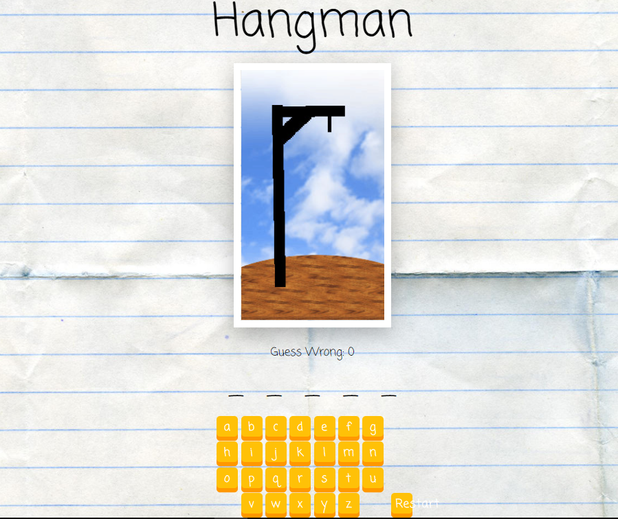

# Hangman

A page where you got five guesses for the correct word. If you fails all the man will be hanged.

## Table of contents

- [Overview](#overview)
  - [The challenge](#the-challenge)
  - [Screenshot](#screenshot)
- [My process](#my-process)
  - [Built with](#built-with)
  - [What I learned](#what-i-learned)
- [Author](#author)

## Overview

### The challenge

Users should be able to:

- Guess the word based on the number of characters of the word
- If you guessed wrong, you'll lose and the page will show you the result
- You can also reset at anytime you'd like

### Screenshot



## My process

### Built with

- Semantic HTML5 markup
- CSS custom properties
- Flexbox
- Javascript
- REACTJS

### What I learned

```js
handleGuess(evt) {
    let ltr = evt.target.value;
    this.setState((st) => ({
      guessed: st.guessed.add(ltr),
      nWrong: st.nWrong + (st.answer.includes(ltr) ? 0 : 1),
    }));
  }
```

## Author

- Frontend Mentor - [@manhtran1611](https://www.frontendmentor.io/profile/manhtran1611)
- Facebook - [@manhtranduc1611](https://www.facebook.com/manhtranduc1611)
